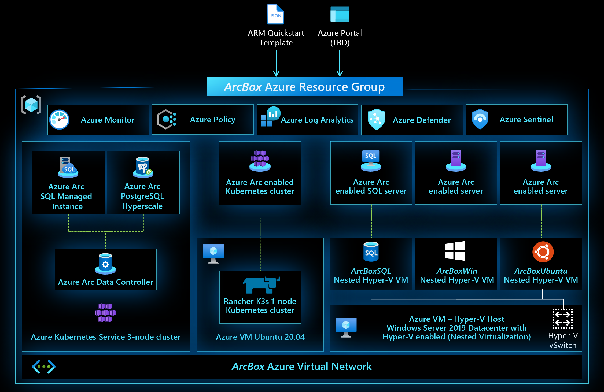
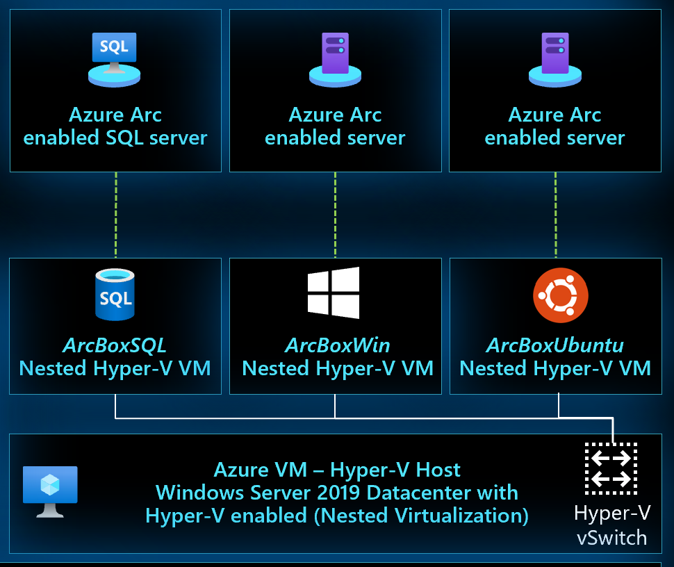
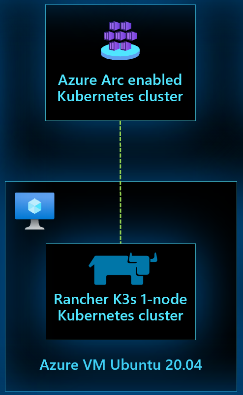
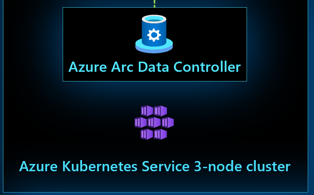
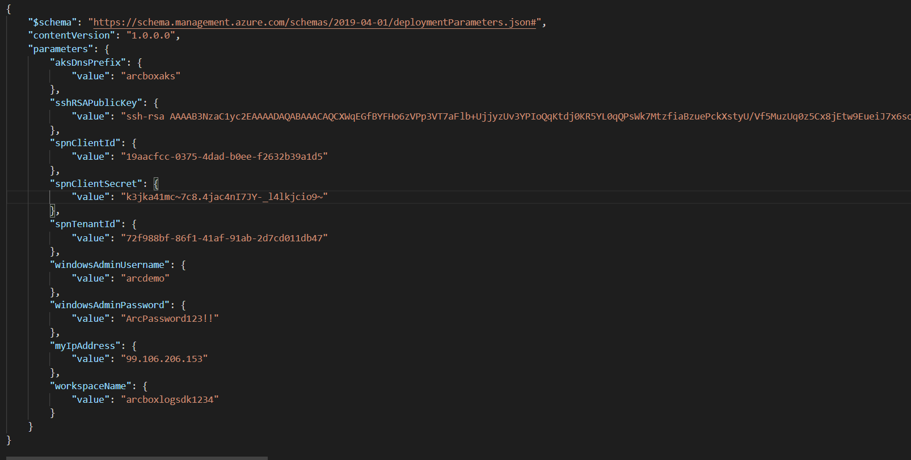
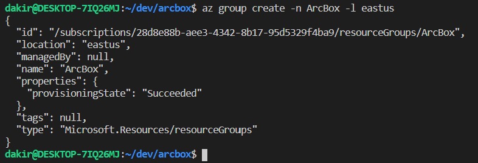

# ArcBox - An Azure Arc Jumpstart project

## ArcBox - Overview



ArcBox is a project that provides an easy to deploy sandbox for all things Azure Arc. ArcBox is designed to be completely self-contained within a single Azure subscription and resource group, which will make it easy for a user to get hands-on with all available Azure Arc technology with nothing more than an available Azure subscription.

Azure Arc capabilities available in ArcBox include:

### Azure Arc enabled Servers



ArcBox includes three Azure Arc enabled server resources. These servers are hosted using nested virtualization in Azure. As part of the deployment, a Hyper-V host (ArcBox-Client) is deployed with three guest virtual machines. These machines, ArcBox-Win, ArcBox-Ubuntu, and ArcBox-SQL are connected as Azure Arc enabled servers via the ArcBox automation.

### Azure Arc enabled Kubernetes



ArcBox deploys one Rancher (K3s) cluster running on an Azure virtual machine. This cluster is then connected to Azure as an Azure Arc enabled Kubernetes resource (ArcBox-K3s).

### Azure Arc enabled Data Services

ArcBox deploys an AKS cluster, which is then used to deploy an Azure Arc enabled data services data controller.



### Unified Operations Management

## Prerequisites

* Clone the Azure Arc Jumpstart repository

    ```shell
    git clone https://github.com/microsoft/azure_arc.git
    ```

* [Install or update Azure CLI to version 2.15.0 and above](https://docs.microsoft.com/en-us/cli/azure/install-azure-cli?view=azure-cli-latest). Use the below command to check your current installed version.

  ```shell
  az --version
  ```

* [Generate SSH Key](https://help.github.com/articles/generating-a-new-ssh-key-and-adding-it-to-the-ssh-agent/) (or use existing ssh key)

* Create Azure service principal (SP)

    To connect the GCP virtual machine to Azure Arc, an Azure service principal assigned with the "Contributor" role is required. To create it, login to your Azure account run the below command (this can also be done in [Azure Cloud Shell](https://shell.azure.com/)).

    ```shell
    az login
    az ad sp create-for-rbac -n "<Unique SP Name>" --role contributor
    ```

    For example:

    ```shell
    az ad sp create-for-rbac -n "http://AzureArcGCP" --role contributor
    ```

    Output should look like this:

    ```json
    {
    "appId": "XXXXXXXXXXXXXXXXXXXXXXXXXXXX",
    "displayName": "AzureArcGCP",
    "name": "http://AzureArcGCP",
    "password": "XXXXXXXXXXXXXXXXXXXXXXXXXXXX",
    "tenant": "XXXXXXXXXXXXXXXXXXXXXXXXXXXX"
    }
    ```

    > **Note: It is optional but highly recommended to scope the SP to a specific [Azure subscription and resource group](https://docs.microsoft.com/en-us/cli/azure/ad/sp?view=azure-cli-latest)**

## Automation flow

Here is a brief explanation of ArcBox's automation steps for you to get familiar with the automation and deployment flow.

1. asdf

2. asdf

3. asdf

4. asdf

## Deployment Option 1: Azure Portal

[](https://portal.azure.com/#create/Microsoft.Template/uri/https%3A%2F%2Fraw.githubusercontent.com%2Fdkirby-ms%2Farcbox%2Fmain%2Fazuredeploy.json)

## Deployment Option 2: Azure CLI

* First login to AZ CLI using the ```az login``` command.

* Now you will need to edit the [azuredeploy.parameters.json](./azuredeploy.parameters.json) ARM template parameters file and supply some values for your environment.

  * *aksDnsPrefix* - AKS unique DNS prefix
  * *sshRSAPublicKey* - Your SSH public key
  * *spnClientId* - Your Auzre service principal id
  * *spnClientSecret* - Your Azure service principal secret
  * *spnTenantId* - Your Azure tenant id
  * *windowsAdminUsername* - Client Windows VM Administrator name
  * *windowsAdminPassword* - Client Windows VM administrator password
  * *myIpAddress* - Your local IP address. This is used to allow remote RDP and SSH connections to the Client Windows VM and K3s Rancher VM.
  * *logAnalyticsWorkspaceName* - Unique name for the ArcBox log analytics workspace

    

* Now you will deploy the ARM template. Navigate to the local cloned [deployment folder](../) and run the below command:

    ```shell
    az group create --name <Name of the Azure resource group> --location <Azure Region>
    az deployment group create \
    --resource-group <Name of the Azure resource group> \
    --template-file azuredeploy.json \
    --parameters azuredeploy.parameters.json 
    ```

    